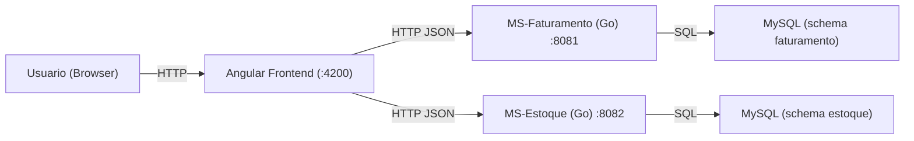

# Arquitetura (Visao Logica)

## Objetivo

Aplicacao web para cadastro de produtos, criacao de notas fiscais e impressao/finalizacao de notas, garantindo:

- Persistencia real em banco de dados
- Regra de negocio de estoque (baixa de saldo ao imprimir)
- Tratamento de falhas entre microsservicos
- (Opcional) Concorrencia e idempotencia

## Componentes

- Frontend: Angular (SPA)
- MS-Faturamento: Go + MySQL (porta `8081`)
- MS-Estoque: Go + MySQL (porta `8082`)
- Banco de dados: MySQL (schemas `faturamento` e `estoque`)

## Diagrama (C4 simplificado)

## Fluxos Principais

### 1) Cadastro de Produtos

- Frontend chama MS-Estoque:
  - `POST /api/produtos` (criar)
  - `GET /api/produtos` (listar)
  - `PUT /api/produtos/:id` (editar)

### 2) Cadastro de Notas Fiscais

- Frontend chama MS-Faturamento:
  - `POST /api/notas` (criar nota com status `ABERTA` e numero sequencial gerado no backend)
  - `POST /api/notas/:id/itens` (incluir itens)
  - `GET /api/notas` e `GET /api/notas/:id/itens` (listar/detalhar)

### 3) Impressao / Finalizacao

Regra: somente notas `ABERTA` podem ser impressas/finalizadas.

Fluxo recomendado (frontend orquestra):

1. Baixa saldo no MS-Estoque para cada item:
   - `POST /api/produtos/:id/baixar-saldo` com `{ quantity, numero_nota_fiscal }`
2. Fecha a nota no MS-Faturamento:
   - `PUT /api/notas/:id/imprimir` (marca como `IMPRESSA`)

Observacao: existe tambem uma rota de orquestracao no MS-Faturamento:

- `POST /api/notas/:id/finalizar` (baixa estoque + marca `IMPRESSA`)

## Resiliencia (Falhas Entre Microsservicos)

- Se a baixa de estoque falhar para algum item, a operacao deve:
  - Informar erro ao usuario
  - Manter nota como `ABERTA`
  - Compensar baixas ja feitas (estorno) quando aplicavel

## Concorrencia (Opcional)

Problema: produto com saldo 1 sendo usado em duas notas ao mesmo tempo.

Solucao:

- MS-Estoque realiza baixa atomica no banco:
  - `UPDATE ... SET quantidade_estoque = quantidade_estoque - ? WHERE id = ? AND quantidade_estoque >= ?`
- Assim somente uma requisicao consegue baixar; a outra recebe "Estoque insuficiente".

## Idempotencia (Opcional)

Problema: clique duplo / retry de rede causando baixa duplicada.

Solucao:

- A baixa envia `numero_nota_fiscal` e o MS-Estoque aplica uma constraint unica:
  - `UNIQUE (produto_id, tipo, numero_nota_fiscal)` em `movimentacoes_estoque`
- Uma chamada repetida retorna sucesso sem baixar novamente.

